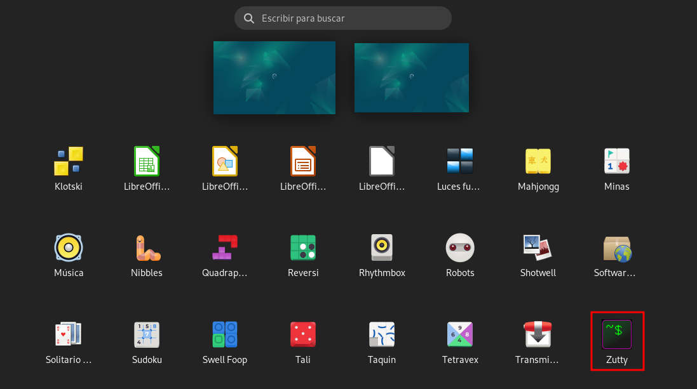
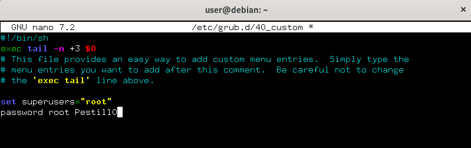
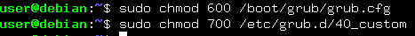
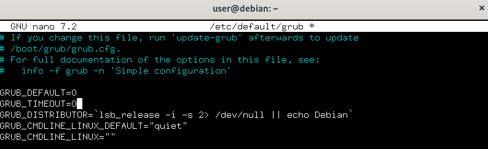
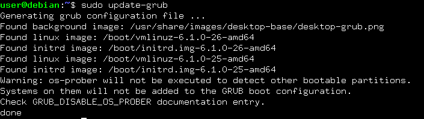

author: Alejandro González Benítez
summary: Bastionado del GRUB de una Debian
id: bastionado-bios
categories: codelab,markdown
environments: Web
status: Published
feedback link: Un enlace en el que los usuarios puedan darte feedback (quizás creando un issue en un repositorio de git)

# Bastionado del GRUB de una Debian

## Introducción
Duration: 0:01:00

En este Colab profundizaremos sobre como bastionar el GRUB del sistema operativo que estamos utilizando. Para este bastionado usaremos un sistema Debian 12.

A continuación se encuentra un resumen de los puntos que veremos en este tutorial :

- Como asignar una contraseña al GRUB para proteger el arranque
- Como establecer permisos para mejorar la seguridad de los archivos de configuración del GRUB
- Como ocultar el menú del GRUB en el arranque

## Requisitos previos
Duration: 0:01:00

Para llevar a cabo las configuraciones se necesita acceder a la terminal del comandos del sistema

Para ello abrimos la pestaña de aplicaciones y ejecutamos la terminal de comandos (Zutty)



## Asignar una contraseña al GRUB
Duration: 0:02:00

Para proteger el acceso al menú de GRUB, estableceremos una contraseña en el archivo de configuración *40_custom*:

Edita el archivo *40_custom* con permisos de administrador:

````bash
set superusers="root"
password root CONTRASEÑA
````


Añadimos las siguientes líneas al final del archivo para definir un usuario con permisos de superusuario en GRUB:



Guardamo y cerramos el archivo.

## Establecer permisos de seguridad de los archivos de configuración del GRUB
Duration: 0:01:00

Para asegurarnos de que solo el usuario root pueda modificar el archivo de configuración de GRUB, ajusta los permisos:



Esto restringirá el acceso a estos archivos, permitiendo que solo el usuario root pueda leer y modificar los archivos críticos.

## Ocultar el Menú de GRUB en el Inicio
Duration: 0:02:00

Para evitar que el menú de GRUB sea visible en el arranque, puedes configurar el tiempo de espera a 0 en el archivo grub:

Editamos el archivo grub en /etc/default/:


Cambiamos la línea de tiempo de espera:

````plaintext
GRUB_TIMEOUT=0
````



Guardamos y cierra el archivo.

## Aplicar cambios en archivos GRUB
Duration: 0:01:00

Después de realizar cambios en los archivos de configuración, debemos regenerar el archivo principal grub.cfg:

````bash
sudo update-grub
````



Esto aplicará los cambios al archivo /boot/grub/grub.cfg.